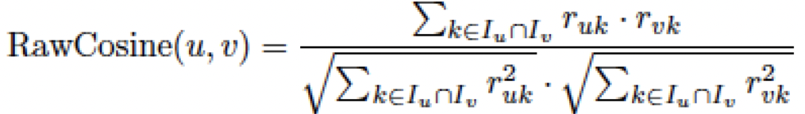
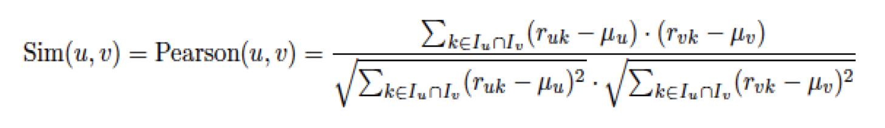
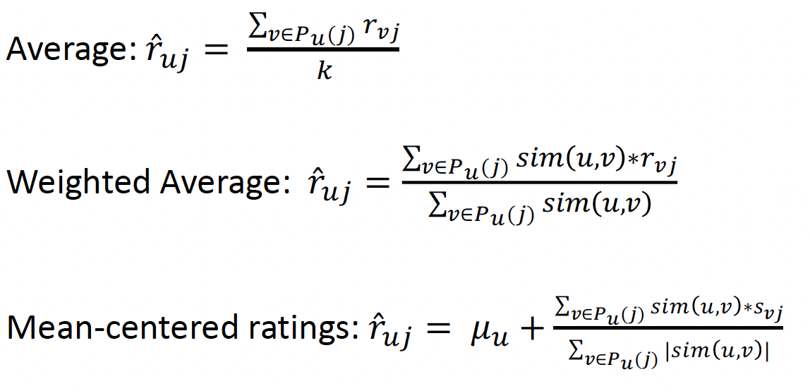
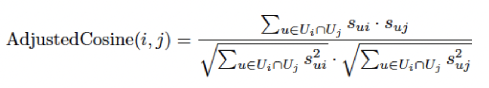
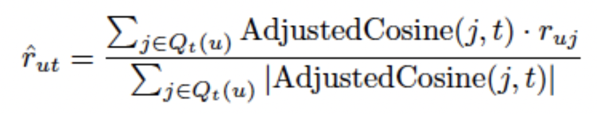

  
  

# Introduction

Recommender systems are ubiquitous and are the backbone of many consumer media giants such as Netflix, Amazon, Hulu, Spotify, etc. With a prolific rise in consumer habits, we now have more data than ever. The main idea of a recommender system is to find a pattern within a user's likes and dislikes, and use that information to recommend an unseen item that the user would like. The prior knowledge that we have of the user would suggest that this is a problem best suited for Machine Learning techniques, which mine for patterns within seemingly chaotic data. The idea of swaying user choice by the power of predictive suggestions is a powerful tool, and an excellent recommender system could push an organization to higher profits. As with most machine learning algorithms, even recommender systems pose a question to the developer. Which algorithm best suits my needs? We try to answer this question by comparing the performance of different algorithms such as User-based collaborative filtering, Item-based collaborative filtering, Content-based collaborative filtering, and Latent-matrix factorization on the movie recommendation dataset. The data and the need should dictate the way we choose to model the problem. Maybe our experiments can help derive standard practices across the board. Recommender systems can be deployed in a variety of settings from clothes, shoes, movies, etc. For this project, we chose the serendipity movie rating dataset. Beyond the main goal of the project - Analysis of various recommender systems algorithms, we also delve into various challenges that one would usually face when designing such a system - Class imbalance, Dataset sampling, etc and potential ways of addressing them. The paper will allow the reader to understand not only the fundamental working concepts of Recommender systems but also the necessary data engineering practices and methods such as - Ways of handling missing values, duplicates, categorical values, etc.

  
  
  

# Method

The aim of the paper as described above is to compare various methods on the same dataset. We will be using RMSE as a comparison metric to understand the differences in the performance of the various techniques. The four methods we will be modeling and analyzing are User-based collaborative filtering, Item-based collaborative filtering, Content-based, and Latent-matrix factorization. The UB-CF method could be thought of as being similar to a Nearest-Neighbour algorithm. We find the nearest neighbor to our target user, that is, we find users with similar likes as our target, and assume that an item rated highly by the neighbor and not yet seen by the target is likely a good recommendation. The method produces largely sparse and high-dimension feature vectors, and according to the hoeffding bound, we would need to have a very large dataset in order to bound the probability of a bad event occurring to a small value. The similarity between any two users can be calculated by using Cosine similarity(eq1) or Pearson correlation coefficient(eq2). The unknown rating can be calculated using average, weighted average, or mean-cantered ratings(eq3). The method is susceptible to a cold start problem for a new user with insufficient data. The IB-CF method on the other hand looks for similarities between pairs of items, rather than users. It analyzes the purchase/watch patterns of a user and recommends by computing the most similar item. The algorithm, similar to the nearest neighbor search, will cluster different items into groups, pick the top k items and return a weighted sum of similar item ratings(eq5). For our experiments, we will be using adjusted cosine similarity(eq4). This method also however is susceptible to the cold start problem when we add new items. Content-based recommendation systems simplify the approach and avoid the cold-start problem by surveying the user for his/her preferences. The recommendations are items that have the highest match with the user preferences. An example would be recommending movies based on genres. A problem with most recommender system algorithms is the sparse nature of the resultant feature matrix. Imagine we were trying to match similar Netflix users. The database consists of ~6000 titles (Movies and TV shows) and an average user might have watched a couple of hundred shows and movies. The likelihood of the feature matrix being sparse is very high. Unlike other methods, we do not have the liberty to simply drop the N/A values, as, by definition, we want to impute these values with the most relevant rating. Even if we were to use dimensionality reduction techniques such as Principal Component Analysis, we would make a drastic compromise on the accuracy of the recommendations. In such methods, we can use the Latent Matrix Factorization method, which initializes two matrices from a distribution at the start, and then iteratively optimizes the values using Gradient Descent. 

  

