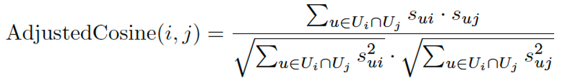

# Abstract

A movie recommendation system is a machine learning-based approach to filter and predict the movies that a given user might enjoy watching based on their past actions or preferences.  Based on the profiles of users and movies, the system generates movie predictions for its users. This project focuses on the implementation and comparative performance analysis of different approaches such as neighborhood-based collaborative filtering, content-based recommendations, and latent matrix factorization model.

  

# Introduction

Recommender systems are ubiquitous and are the backbone of many consumer media giants such as Netflix, Amazon, Hulu, Spotify, etc. With a prolific rise in consumer habits, we now have more data than ever. The main idea of a recommender system is to find a pattern within a user's likes and dislikes, and use that information to recommend an unseen item that the user would like. The prior knowledge that we have of the user would suggest that this is a problem best suited for Machine Learning techniques, which mine for patterns within seemingly chaotic data. The idea of swaying user choice by the power of predictive suggestions is a powerful tool, and an excellent recommender system could push an organization to higher profits. As with most machine learning algorithms, even recommender systems pose a question to the developer. Which algorithm best suits my needs? We try to answer this question by comparing the performance of different algorithms such as User-based collaborative filtering, Item-based collaborative filtering, Content-based collaborative filtering, and Latent-matrix factorization on the movie recommendation dataset. The data and the need should dictate the way we choose to model the problem. Maybe our experiments can help derive standard practices across the board. Recommender systems can be deployed in a variety of settings from clothes, shoes, movies, etc. For this project, we chose the serendipity movie rating dataset. Beyond the main goal of the project - Analysis of various recommender systems algorithms, we also delve into various challenges that one would usually face when designing such a system - Class imbalance, Dataset sampling, etc and potential ways of addressing them. The paper will allow the reader to understand not only the fundamental working concepts of Recommender systems but also the necessary data engineering practices and methods such as - Ways of handling missing values, duplicates, categorical values, etc.

  
  
  

# Methods

The aim of the paper as described above is to compare various recommendation methods on the movielens-1M dataset. We will be using MAE as a comparison metric to understand the differences in the performance of these techniques. The four methods we will be modeling and analyzing are User-based collaborative filtering, Item-based collaborative filtering, Content-based Filtering, and Latent-matrix factorization. Before applying these methods, it is important to perform some data preprocessing. 

## Data Preprocessing

Since we are dealing with a dataset with 1 million observations, dimensionality reduction or filtering out the unnecessary data becomes a necessary step. We eliminated the features such as timestamp, IMDB ID, etc. To understand the relationship between users and movies, we combined the two CSV files, movies, and training, into one data frame and checked for the dimensions and statistical summary of this data frame. We also performed some essential data cleaning steps such as removal of missing values and duplicated rows, factorization of categorical variables, string manipulation to extract the year of release for movies, grouping by the viewers count and mean user rating for movies, and most importantly one-hot-encoding for converting movie genres into separate features. We used statistical summary and some visualizations to respond to a few questions out of curiosity such as how many movie genres are present and what is the most predominant genre in our dataset; approximately how many movies are released each year; which year recorded the most movies; what is the average rating for each movie; how many users watched a particular movie; what are some of the highest-rated movies; who are the users who voted for the maximum number of movies; and what is their rating pattern[2]. After this exploratory data analysis, we utilized the following techniques to recommend movies to different users. Some of the most fascinating observations are listed here. The most number of movies (~17.5k) belong to the drama genre (Figure 1); the most number of movies (443k), was released in 2009, according to statistics (Figure 2). On average, 59k movies are released annually. The Matrix, with ~42k views, is the most viewed movie in our dataset. In terms of user reviews and viewership, it also has the highest rating. Around 20k users gave "The Matrix" a rating of 4.0 or above (Figure 3). The user with ID 148071 rated ~18k movies and his/her average rating for the movies is 3.16.

## Approach 1: User-Based Collaborative Filtering

The UB-CF method could be thought of as being similar to a Nearest-Neighbour algorithm. We find the nearest neighbor to our target user, that is, we find users with similar likes as our target, and assume that an item rated highly by the neighbor and not yet seen by the target is likely a good recommendation[3]. The method produces largely sparse and high-dimension feature vectors, and according to the Hoeffding bound, we would need to have a very large dataset in order to bound the probability of a bad event occurring to a small value. The similarity between any two users can be calculated by using Raw Cosine similarity(Equation 1) or Pearson correlation coefficient(Equation 2). In general, the Pearson correlation coefficient is preferable to the raw cosine because of the bias adjustment effect of mean-centering. This adjustment accounts for the fact that different users exhibit different levels of generosity in their global rating patterns. Once we find the similarity between users, either average, weighted average, or mean-centered average can be used to calculate the unknown rating(Equation 3, Equation 4 and Equation 5). Even though it’s a great method to start with, UB-CF is susceptible to a cold start problem when there are new users, new items or very few users/ratings in the system. 

## Approach 2: Item-Based Collaborative Filtering

The IB-CF method on the other hand looks for similarities between pairs of items, rather than users. It analyzes the purchase/watch patterns of a user and recommends by computing the most similar item[3]. The algorithm, similar to the nearest neighbor search, will cluster different items into groups, pick the top k items and return a weighted sum of similar item ratings(Equation 7). To find the most similar items, we used the adjusted cosine similarity(Equation 6). The biggest advantage of this method is that the pairwise similarities of items can be computed offline as well. While the cold-start problem with new users is resolved, IB-CF is still susceptible to the cold-start problem for new items. In practice, IB-CF is supposed to perform slightly better than UB-CF. However, due to the high amount of training data in our case, UB-CF outperformed IB-CF.

## Approach 3: Content-Based Filtering

Content-based systems are designed to exploit scenarios in which items can be described with descriptive sets of attributes [1]. It is a simplified approach to provide personalized recommendations by surveying the users for their preferences. The recommendations are items that have the highest match with the user preferences. The first phase in all content-based models is to extract discriminative features for representing the items. Discriminative features are those, which are highly predictive of user interests [1]. In our case, these features are extracted from the tags.csv file. A Feature like the movie genre would have been a great measure to assess user preferences but that information is not explicitly available to us. So next, we form the neighborhood using user-item similarities by computing either Cosine similarity (in case of weighted features) (Equation 8) or Jaccard similarity (in case of binary features) (Equation 9). While this method is highly explainable, it requires efforts in terms of feature engineering and may lead to overspecialization with no recommendations out of the user's content zone. There is also another cold-start problem with new users since we do not know how to build a profile for users who decline to provide explicit answers on their preferences. Furthermore, there may be cases where users use tags to indicate things they disliked about a movie, so searching for movies with similar tags ends up being undesirable.

## Approach 4: Latent Matrix Factorization

A problem with most recommender system algorithms is the sparse nature of the resultant feature matrix. Imagine we were trying to match similar Netflix users. The database consists of ~6000 titles (Movies and TV shows) and an average user might have watched a couple of hundred shows and movies. The likelihood of the feature matrix being sparse is very high. Unlike other methods, we do not have the liberty to simply drop the missing values, as, by definition, we want to impute these values with the most relevant rating. Even if we were to use dimensionality reduction techniques such as Principal Component Analysis, we would make a drastic compromise on the accuracy of the recommendations. In such methods, we can use the Latent Matrix Factorization method which is an alternative to neighborhood-based collaborative filtering and tries to characterize users and items from factors inferred from ratings. It Offers scalability and good predictive accuracy since it’s derived from dimensionality reduction techniques called Singular Value Decomposition (SVD). This Netflix-prize-winning approach exploits the fact that parts of the rows and columns of the utility matrix are highly correlated. The factor vectors are estimated either using Stochastic Gradient Descent (SGD) or Alternating Least Squares (ALS)(Equation 10). Even though this method works great even with the sparse matrix, latent models are not necessarily interpretable in practice. We used the surprise library and experimented with algorithms such as KNN, SVD, and SVDpp. We used the GridSearchCV class which computes the accuracy metrics for an algorithm on various combinations of parameters, over a cross-validation procedure and searches for the best parameters for a prediction algorithm.

# Comparisons

The evaluation metric that we used for comparing the various approaches of a movie recommendation system is the Mean Absolute Error (MAE) (Equation 11). For UB-CF, we got the mean absolute error of 1.23 which means that on average our UB-CF engine is making an error of 1.23 in predicting the ratings by users. For IB-CF, we got the mean absolute error of 2.43 which means that on average our IB-CF engine is making an error of 2.43 in predicting the ratings for items. For the content-based model, we got the mean absolute error of 4.03 which means that on average our content-based model is making an error of 4.03  in predicting the ratings by users. For latent-matrix factorization, we are using different algorithms such as KNN, SVD, and SDVpp from the surprise library for which we got MAE of 0.72, 0.68, and 0.67 respectively.
Comparison (figure 4).

Apart from this evaluation, we found the top-5 recommendations for a random user with ID “100726” with all four algorithms and compared them against each other (figure 5 and figure 6).

# Example Analysis:

This method would provide a developer with better intuition regarding which recommender system algorithm works best for a given scenario. If an organization were to develop a new streaming platform, similar to Netflix, they would have a head-start by understanding the contents of this project. 

# Two Step Learning:

Step 1:
The two-step learning process requires that we first approximate E_in to be close to E_out with a high degree of accuracy. 

For User-based, Item-based and Matrix-Factorizarion method:
The number of features: 27003
Let us take Epsilon = 0.01
To make sure that E-In approximates E_out with a high probability of let's say greater than 95%

N ~ 61,415.

This means that we need a minimum of 61,415 training examples to approximate e_in within e_out ( 0.01 error tolerance) with a high probability of greater than 95%.

Note: 
1) Content based recommendation systems work with categorical labels, and the prediction accuracy cannot be interpreted as a numerical value, therefore it is largely unclear how Epsilon could be picked, therefore traditional Hoeffding does not hold relevant.

As for collaborative filtering methods, we cannot apply the traditional Hoeffding inequality as:

2)  We are not iteratively trying to find the best “hypothesis”. Rather, we are simply finding the nearest similar user by using similarity metrics such as cosine similarity.

3) We are also constrained by the computing resources available to us. To achieve 64,415 training samples, we must preprocess >>1 million rows of raw data, which is not a viable option. 
Each row in our training matrix represents 1 user. 

Step 2:
We need to bring E_In close to 0.

User - Based CF - 1.38
Item - Based CF - 2.56
Content - Based CF - 4.39
Latent Factor SCD - 0.89
Latent Factor SCDpp  - 0.75

We see that these values are close to our E_out values for the individual algorithms.

# Conclusion:

We have seen in detail the different recommender system methods. By providing accuracy and performance metrics for the different algorithms, we can, with reasonable confidence draw a conclusion that matrix Factorization proves to be the best algorithm of the four. That being said, ultimately, the dataset and the use case must dictate the choice of the algorithm. If we are dealing with very large datasets, then it would be advised to pick the Matrix Factorization method over the rest. Furthermore, if we were to take into account multiple factors (such as both user preferences and item characteristics), then again, Matrix Factorization is the best choice. Alternatively, if we find ourselves to be working with a small dataset, or if we are taking into account only a single factor (either user preference or item characteristics) then, it is advisable to pick User Based, or Item-Based over the Matrix Factorization method. Finally, content-based recommender systems can be used when there is a dearth of prior data pertaining to a user, or an item. Essentially, A new user would be asked to fill in a quick survey, whose results are used to run a content-based recommendation algorithm (Bypassing the cold-start problem), then as we begin to accumulate more user data, we can switch over to UB/IB - CF, finally, as the user data becomes increasingly large, we can begin to run the Matrix Factorization algorithm. Thus, at any point in time, the dataset and the use case must dictate the choice of the algorithm.

